<a href="https://ldallacqua.github.io/siren-siege/">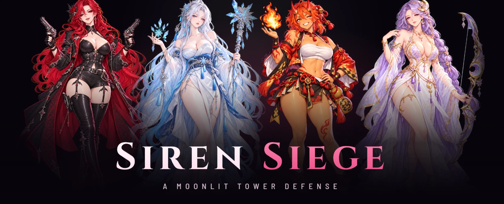</a>

<p align="center"><em>Beauty is the last line of defense.</em></p>

<p align="center">
  <a href="https://ldallacqua.github.io/siren-siege/"></a>
</p>

<p align="center">
  <a href="https://github.com/ldallacqua/siren-siege/actions/workflows/deploy.yml"></a>
  
  
  
  
  
</p>

<p align="center">
  <a href="#-the-game">The game</a> ·
  <a href="#-meet-the-sirens">Heroines</a> ·
  <a href="#-how-to-play">How to play</a> ·
  <a href="#-under-the-hood">Under the hood</a> ·
  <a href="#-develop">Develop</a> ·
  <a href="#-docs">Docs</a>
</p>

<br>

<p align="center">
  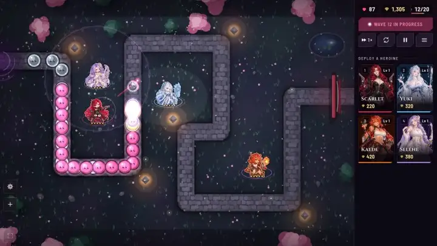
</p>

<br>

## 🌙 The game

Every hundred years, on the night of the **Crimson Eclipse**, the moon's light fails and **the Blight** climbs the shrine road in waves. Five sirens stand between it and the last Moongate, and you are their Commander.

**Siren Siege** is a browser tower defense in the mold of _Bloons TD 6_: layered enemies that peel apart as you hit them, three upgrade paths per tower with crosspathing, targeting priorities, and bosses. The difference is who your towers are. Each is a heroine with her own personality, story and upgrade tree, and fighting beside her raises her **Bond**, which unlocks branching chats, gallery art and a little extra power.

It runs on desktop and phone, portrait and landscape, and installs to your home screen to play offline. No account, no backend, no downloads: your progress lives in your browser.

<table>
  <tr>
    <td width="50%" valign="top">
      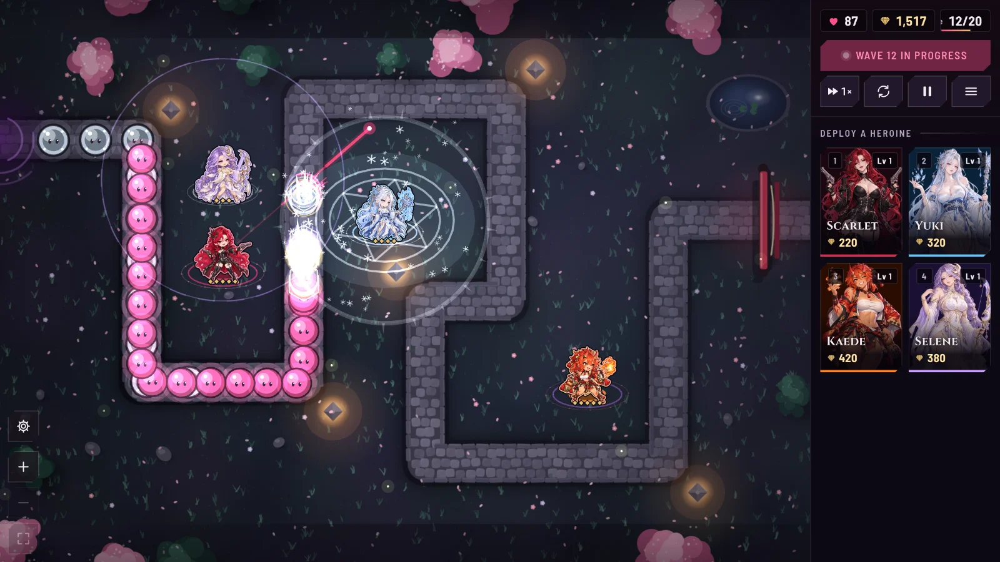
      <h3>A tower defense that stands on its own</h3>
      20 hand-tuned waves of layered Blight, armored husks that shrug off bullets, and a Colossus boss. Place heroines, pick targeting (first, last, strong, close), and read a battlefield painted with lanterns, sakura, fireflies and a torii gate. Pinch or scroll to zoom, run it at 1×, 2× or 3×.
    </td>
    <td width="50%" valign="top">
      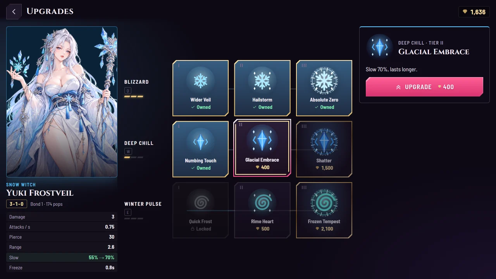
      <h3>BTD-style upgrade trees</h3>
      Three paths × three tiers per heroine with the crosspath rule (one path to tier 3, one to tier 2). Every tier-3 unlocks a <b>signature effect</b>: Scarlet's blood-moon sniper beam, Yuki's ice vortex, Kaede's oni meteor, Selene's falling stars, Nemu's dream-devouring bite. Effects grow with each tier you buy.
    </td>
  </tr>
  <tr>
    <td width="50%" valign="top">
      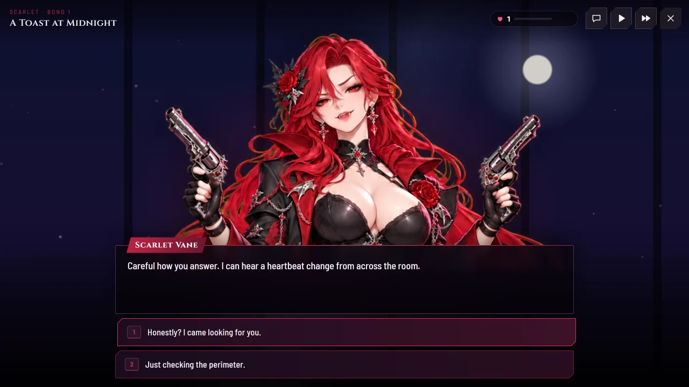
      <h3>Bond, chats and a story worth unlocking</h3>
      25 branching visual-novel chats (Bond 1, 3, 5, 7 and 9 for each heroine, ending in a confession), painted scenes with ambient snow, embers and lanterns, voice blips, auto and skip. Answer well and she remembers it.
    </td>
    <td width="50%" valign="top">
      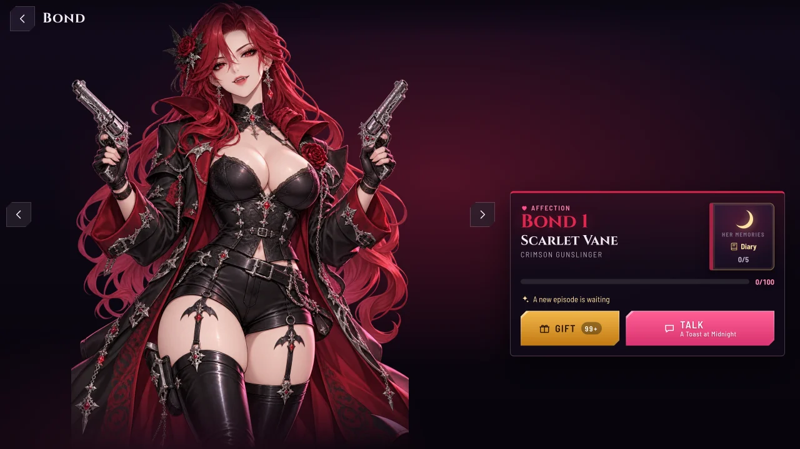
      <h3>Diaries and gifts</h3>
      Each heroine keeps a diary of your episodes together. Battles drop gifts; every heroine loves two and likes one, and you only find out which by giving them. The lore grows with Bond, too: her story, the Codex and a bestiary of the Blight.
    </td>
  </tr>
</table>

<h3 align="center">Made for your phone as much as your desk</h3>

<p align="center">
  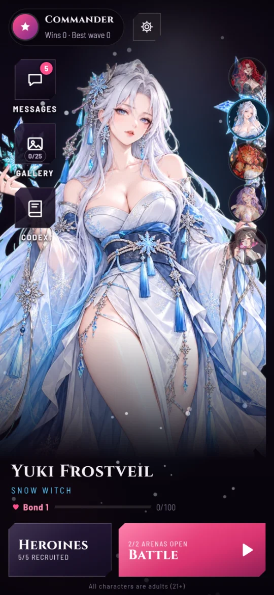
  &nbsp;
  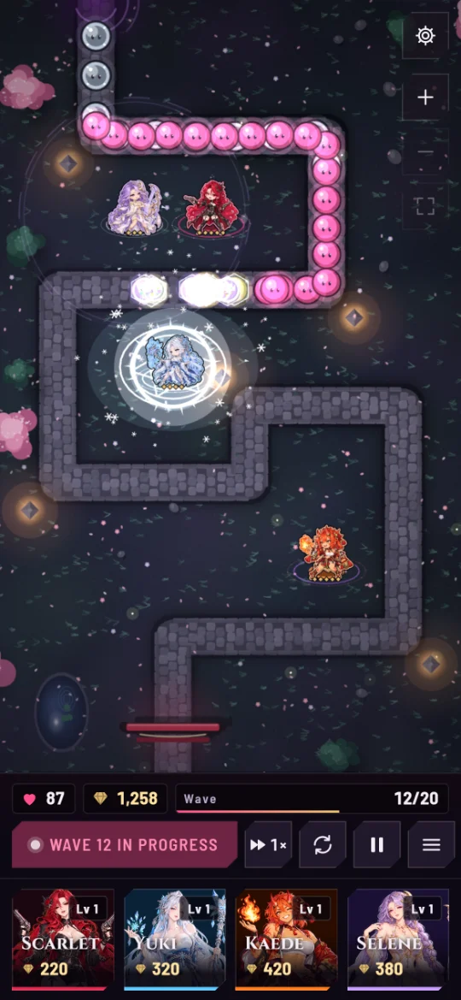
  &nbsp;
  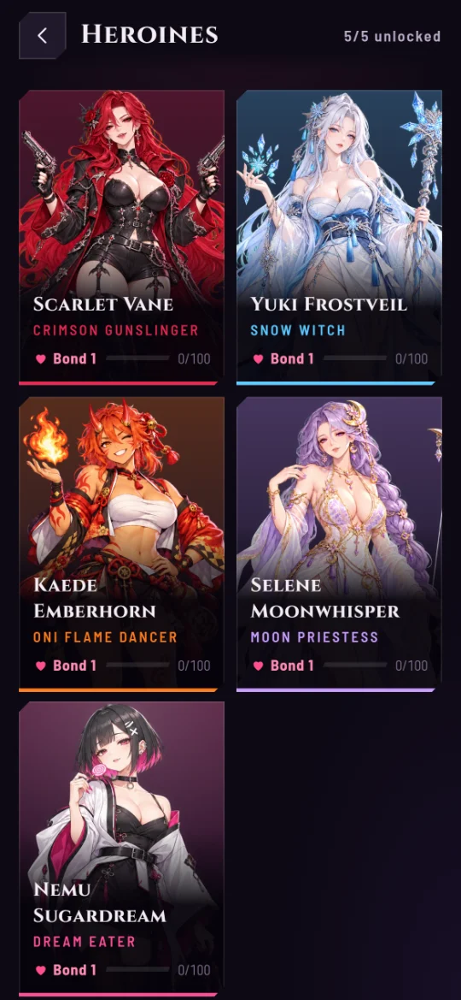
</p>

<p align="center"><sub>In portrait the map turns to fill the screen and the shop docks at the bottom. Add it to your home screen for a full-screen, offline app.</sub></p>

## 💋 Meet the sirens

<table>
  <tr>
    <td align="center" width="20%">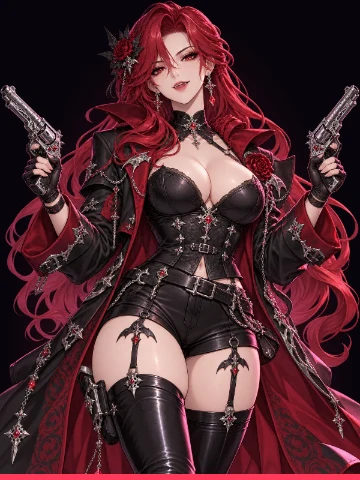</td>
    <td align="center" width="20%">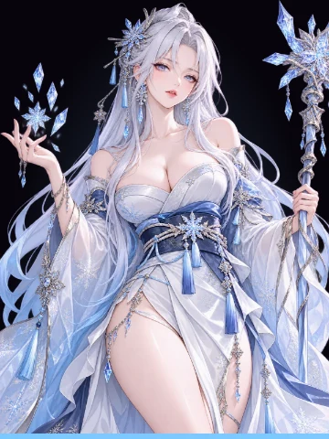</td>
    <td align="center" width="20%">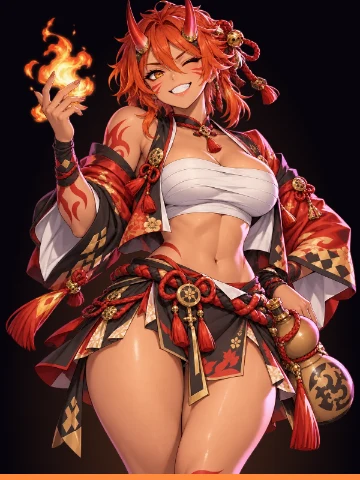</td>
    <td align="center" width="20%">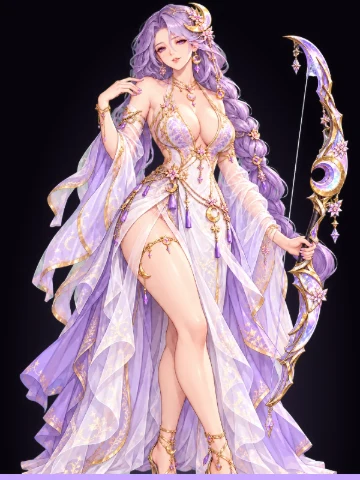</td>
    <td align="center" width="20%">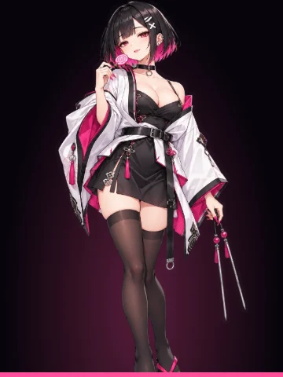</td>
  </tr>
  <tr>
    <td align="center"><b>Scarlet Vane</b><br><sub>Crimson Gunslinger · 27</sub></td>
    <td align="center"><b>Yuki Frostveil</b><br><sub>Snow Witch · 24</sub></td>
    <td align="center"><b>Kaede Emberhorn</b><br><sub>Oni Flame Dancer · 29</sub></td>
    <td align="center"><b>Selene Moonwhisper</b><br><sub>Moon Priestess · 26</sub></td>
    <td align="center"><b>Nemu Sugardream</b><br><sub>Dream Eater · 21</sub></td>
  </tr>
  <tr>
    <td valign="top"><sub>Vampire with a pair of silver revolvers: confident, teasing, dangerous. Fast single-target damage that learns to pierce armor.</sub></td>
    <td valign="top"><sub>Ice witch of the mountain pass: cool, aloof, secretly shy. Frost pulses that slow, freeze and shatter crowds.</sub></td>
    <td valign="top"><sub>Festival fire dancer with horns and big-sister energy. Arcing fireballs that splash whole clusters.</sub></td>
    <td valign="top"><sub>Idol priestess of the moon: gentle, elegant, a little mischievous. Buffs allies, earns gold, calls down starfall.</sub></td>
    <td valign="top"><sub>Sleepy baku who eats nightmares: deadpan, lazy, secretly sweet. Silver hairpins that put the Blight to sleep.</sub></td>
  </tr>
  <tr>
    <td valign="top"><sub>🔫 Crimson Rounds<br>⚡ Quickdraw<br>🌑 Night Sight → <i>Blood Moon Sniper</i></sub></td>
    <td valign="top"><sub>❄️ Blizzard → <i>Absolute Zero</i><br>🧊 Deep Chill → <i>Shatter</i><br>🌀 Winter Pulse</sub></td>
    <td valign="top"><sub>🔥 Inferno → <i>Crimson Lotus</i><br>🎆 Wildfire → <i>Fireworks Finale</i><br>👹 Demon Heart → <i>Oni Awakening</i></sub></td>
    <td valign="top"><sub>🌙 Moonlit Blessing → <i>Goddess Descent</i><br>🪙 Tribute → <i>Lunar Treasury</i><br>🏹 Lunar Arrows → <i>Starfall</i></sub></td>
    <td valign="top"><sub>💤 Lullaby → <i>Sweet Dreams</i><br>🍬 Bitter Feast → <i>Devour</i><br>📍 Sleepwalker → <i>Night Parade</i></sub></td>
  </tr>
  <tr>
    <td align="center"><sub>Starts unlocked</sub></td>
    <td align="center"><sub>Starts unlocked</sub></td>
    <td align="center"><sub>🔒 Reach wave 10</sub></td>
    <td align="center"><sub>🔒 Clear Moonlit Shrine</sub></td>
    <td align="center"><sub>🔒 Reach wave 15</sub></td>
  </tr>
</table>

<details>
<summary><b>The Blight</b>: what you're fighting</summary>
<br>

The Blight is what's left when a memory is eaten. Each layer is a stolen memory; popping one sets it free.

| Enemy               | What it is                                                                      |
| ------------------- | ------------------------------------------------------------------------------- |
| **Mote**            | A single lost memory: a name, a smell, a song.                                  |
| **Flicker**         | Two memories tangled together; it has started to remember hunger.               |
| **Glimmer**         | A cluster bright enough to lure travelers off the road.                         |
| **Blaze**           | A memory of panic, fast and burning.                                            |
| **Twin Wisp**       | Two Blazes circling each other.                                                 |
| **Iron Husk**       | Grief hardened into armor. Bullets bounce off; silver, fire and song don't.     |
| **Blight Colossus** | A fragment of the Hollow King, testing the seal. Has a health bar and a bounty. |

</details>

<details>
<summary><b>The arenas</b></summary>
<br>

| Arena              | Difficulty | Unlock                    |                                                                                  |
| ------------------ | ---------- | ------------------------- | -------------------------------------------------------------------------------- |
| **Moonlit Shrine** | Normal     | Open                      | The last Moongate. A long, winding garden road with room to learn every heroine. |
| **Frostveil Pass** | Hard       | Wave 10 on Moonlit Shrine | Yuki's silent mountain. A short, steep pass: the Blight reaches the gate fast.   |

</details>

## 🎮 How to play

1. **Deploy** a heroine from the shop onto the grass beside the path. On touch, drag to position her and tap **Place**.
2. **Start** the wave. Enemies walk the road; every layer you pop pays gold.
3. **Tap a heroine** to upgrade her (quick-buy the next tier of any path, or open the full tree), change her targeting, or sell her for 70%.
4. **Survive 20 waves.** After each battle, every heroine you fielded earns Bond; visit **Messages** to read new chats and hand out gifts.

<details>
<summary><b>Keyboard shortcuts</b></summary>
<br>

| Key                                    | Action                              | Key                                    | Action                  |
| -------------------------------------- | ----------------------------------- | -------------------------------------- | ----------------------- |
| <kbd>1</kbd>–<kbd>5</kbd>              | Pick a heroine to place             | <kbd>Space</kbd>                       | Start the next wave     |
| <kbd>Q</kbd> <kbd>W</kbd> <kbd>E</kbd> | Buy the next tier of path 1 / 2 / 3 | <kbd>F</kbd>                           | Game speed 1× → 2× → 3× |
| <kbd>U</kbd>                           | Open the upgrade tree               | <kbd>P</kbd>                           | Pause                   |
| <kbd>Tab</kbd>                         | Cycle targeting                     | <kbd>M</kbd>                           | Mute                    |
| <kbd>Delete</kbd>                      | Sell the selected heroine           | <kbd>+</kbd> <kbd>−</kbd> <kbd>0</kbd> | Zoom in / out / fit     |
| <kbd>Esc</kbd>                         | Cancel / close                      |                                        |                         |

In chats: <kbd>Space</kbd> advances, <kbd>1</kbd> <kbd>2</kbd> answer, <kbd>A</kbd> auto, <kbd>S</kbd> skip, <kbd>L</kbd> log.

</details>

## 🔮 Under the hood

A small, dependency-light codebase: **Phaser 4** draws the battlefield, plain **TypeScript + DOM** draw everything else, and there is no backend.

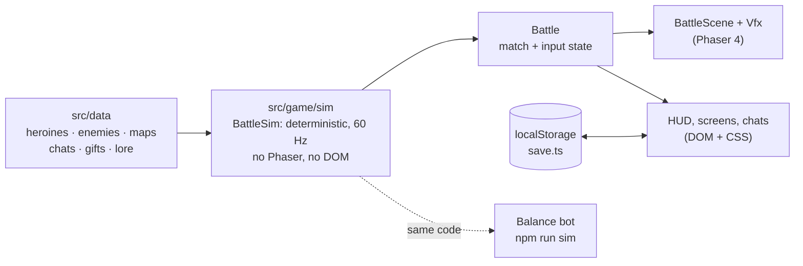

- **A pure, deterministic simulation.** Spawning, targeting, damage, layers and economy run in plain TypeScript at a fixed 60 Hz with no Phaser or DOM, so unit tests and a **headless balance bot** play the exact same game the browser does.
- **Every sound is synthesized.** SFX, voice blips and the lofi and battle music (full song forms with sections, not loops) are generated with the Web Audio API. The repo contains no audio files.
- **Effects are data.** A pure function turns a heroine's upgrade path into her effect palette, scale and tier-3 signature, so visuals always match the build.
- **Installable and offline.** A hand-written service worker and web manifest; the page checks for a newer build on boot so players are never stuck on an old deploy.
- **Tested in a real browser.** A Playwright smoke test drives desktop, phone-portrait and phone-landscape through the whole game and saves screenshots of every screen.

## 🛠 Develop

Needs **Node 22.6+** (see `.nvmrc`).

```bash
git clone https://github.com/ldallacqua/siren-siege.git
cd siren-siege
npm install
npm run dev        # http://localhost:5173/?dev  (dev mode: everything unlocked, 20k gold)
```

| Command         | What it does                                                                      |
| --------------- | --------------------------------------------------------------------------------- |
| `npm run dev`   | Dev server; add `?dev` for all unlocks and the `window.siren` debug hook          |
| `npm run check` | **The gate**: Prettier, typecheck, unit tests, balance bot and a production build |
| `npm run smoke` | Real-browser test on three viewports; screenshots in `artifacts/smoke/`           |
| `npm run sim`   | Balance bot plays all 20 waves and prints lives and cash per wave                 |
| `npm run fx`    | Renders each heroine's effects across five upgrade builds, side by side           |
| `npm run shots` | Regenerates the images in this README (`docs/readme/`)                            |
| `npm run art`   | Converts dropped-in PNG/JPG art to correctly sized WebP                           |

**Shipping.** Pushing to `main` deploys to GitHub Pages. `npm install` wires up a **pre-push hook** (`.githooks/pre-push`) that runs `npm run check` and the smoke test on the exact commit you're pushing (about 2 minutes on a laptop), so CI only re-runs the fast gate before deploying. The hook skips commits that already passed and docs-only pushes; `SKIP_SMOKE=1 git push` skips the browser test in a pinch.

<details>
<summary><b>Project layout</b></summary>
<br>

```
src/
  data/        Pure content: heroines, enemies, maps + waves, chats, gifts, lore, progression
  game/sim/    Pure deterministic battle simulation (runs in Node for tests and the bot)
  game/        Phaser scene, effects, painted map art, camera and chibi animation
  ui/          HUD, screens, upgrade tree, Bond/Messages, visual-novel chat player
  audio/       Synthesized SFX and music (Web Audio)
  state/       Versioned localStorage save
public/art/    Heroine portraits, moods, chibis and gallery art (WebP)
scripts/       Balance bot, smoke test, effects preview, README shots, art import
tests/         Vitest: data integrity, simulation, camera, audio, gifts, effects
docs/          Design, architecture, style guides, lore, status and backlog
```

</details>

<details>
<summary><b>Adding art</b></summary>
<br>

Drop WebP files into `public/art/<heroine>/`: `portrait.webp`, `portrait-<mood>.webp`, `chibi.webp`, `gallery-1.webp` … `gallery-5.webp`. The game picks them up automatically and shows generated placeholders for anything missing. PNG/JPG uploads can be converted with `npm run art`. The step-by-step guide with image prompts is [docs/ART_GUIDE.md](docs/ART_GUIDE.md); the style bible is [docs/ART_DIRECTION.md](docs/ART_DIRECTION.md).

</details>

<details>
<summary><b>Working on it with AI agents</b></summary>
<br>

This project is built to be picked up by any coding agent (Claude Code, Codex, Cursor, Copilot, Gemini…) with no memory of previous sessions. Start at [AGENTS.md](AGENTS.md): it has the rules, the code map and recipes for common tasks. [docs/STATUS.md](docs/STATUS.md) is the living handoff (what works, known issues, what the last session did) and [docs/BACKLOG.md](docs/BACKLOG.md) is the prioritized queue. Every session ends by updating both. The short resume prompt is in [PROMPT.md](PROMPT.md).

</details>

## 📜 Docs

| Doc                                                                     | What's in it                                         |
| ----------------------------------------------------------------------- | ---------------------------------------------------- |
| [GDD](docs/GDD.md)                                                      | Game design: pillars, systems, scope and milestones  |
| [LORE](docs/LORE.md)                                                    | The Moonlit Isles, the Blight, every heroine's story |
| [UI_STYLE](docs/UI_STYLE.md)                                            | The "Moonlit Noir" design system and motion rules    |
| [ARCHITECTURE](docs/ARCHITECTURE.md)                                    | How the pieces fit together                          |
| [DECISIONS](docs/DECISIONS.md)                                          | Why things are the way they are                      |
| [ART_DIRECTION](docs/ART_DIRECTION.md) · [ART_GUIDE](docs/ART_GUIDE.md) | Art style, asset specs and the generation workflow   |
| [STATUS](docs/STATUS.md) · [BACKLOG](docs/BACKLOG.md)                   | Where the project is and what's next                 |

## ⚖️ Content and license

All characters are fictional adults (21+). The tone is flirty and suggestive fan service, never nudity or explicit content.

Code and art © Lucas ([@ldallacqua](https://github.com/ldallacqua)), all rights reserved. Fonts: [Cinzel](https://fonts.google.com/specimen/Cinzel) and [Barlow Semi Condensed](https://fonts.google.com/specimen/Barlow+Semi+Condensed), under the SIL Open Font License (`public/fonts/`). Built with [Phaser](https://phaser.io/).

<br>

<p align="center">
  <a href="https://ldallacqua.github.io/siren-siege/"><b>▶ Play Siren Siege</b></a>
  <br>
  <sub>🌙 The moon is watching. Don't let the gate fall. 🌙</sub>
</p>
