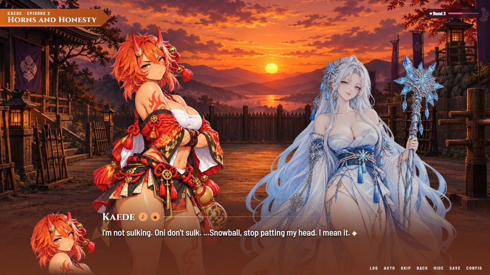
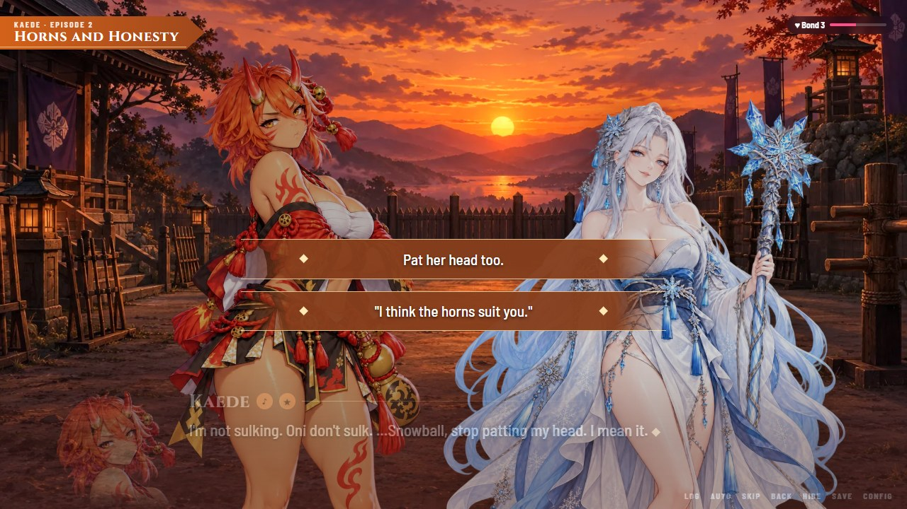
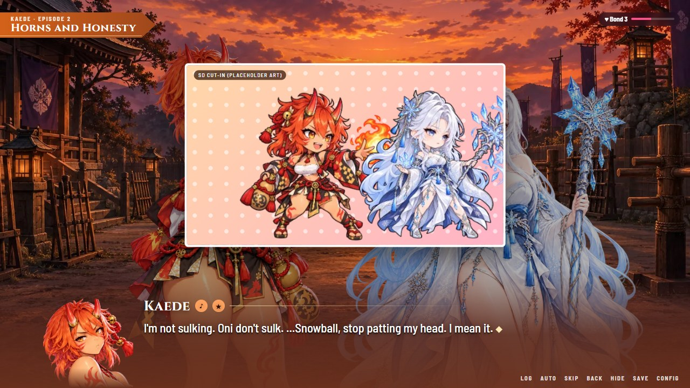
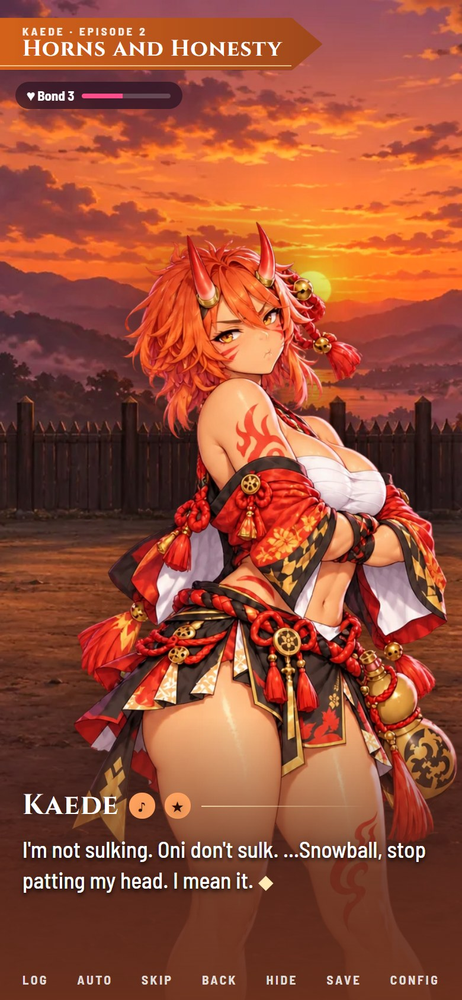

# Visual novel direction: the Yuzusoft bar

The owner's reference for everything story in this game is **Yuzusoft**: _Senren＊Banka_, _Sabbat of the Witch_ and their other titles. This document says what that means for Siren Siege: what those games do, which parts we take, the standard every heroine and every scene must meet, the look of the story screens, what we can and cannot build, and the order to build it in.

Read it before writing a chat, a bio or a story chapter, and before touching the chat player. `docs/LORE.md` stays the canon (who, where, what happened); this file is the craft (how it is told and shown).

**Status (2026-10-03):** direction given by the owner. Nothing here is built yet except where "Today" says so. A big story is not planned now; the order of work is in section 9. Items marked **Proposal** are mine and are not canon until the owner approves them (section 11).

**How this was researched:** reviews and trope summaries of four Yuzusoft games, and the store screenshots of _Senren＊Banka_ and _Sabbat of the Witch_ (sources in section 12). I have not played them. Where a claim comes from one reviewer it says so. The owner knows these games first hand: when his memory and this file disagree, he is right and the file gets fixed.

## 1. The reference in one page

Yuzusoft makes romance comedies with a light supernatural premise, sold on three things: heroines people remember, a level of polish few studios match, and comfort. The pattern, title after title:

- **A premise that gives everyone a secret.** A cursed hot-spring town and a sword spirit (_Senren＊Banka_); witches who collect fragments of emotion to buy one wish (_Sabbat of the Witch_); a café run by a grim reaper (_Café Stella_). The supernatural part exists to put pressure on feelings, not to be a plot for its own sake.
- **A common route with the whole cast**, built from small cases and a lot of banter, where the group becomes a family. Then **one route per heroine**: slice of life and romance first, her personal problem second, an ending, and an **after story**.
- **A protagonist with a self.** Shuuji (_Sabbat_) physically senses other people's emotions and has kept everyone at a distance because of it; Masaomi (_Senren_) is clever and lazy until something forces him to train. Reviewers single this out: not a blank slate, has opinions, has his own arc.
- **Presentation that never sits still.** Sprites change expression inside a sentence, comic beats cut to super-deformed (chibi) drawings, key moments get a full illustration, every line of every character except the protagonist is voiced.
- **Systems that respect the reader's time:** a flowchart of every choice with jumps, skip, rewind, a favourite-voice list, suspend and resume anywhere, a text window you can restyle.

What reviewers hold against them is as useful as the praise (section 2.6).

## 2. What makes these games work

### 2.1 Heroines

Every memorable Yuzusoft heroine is built from the same four parts.

| Part                 | What it is                                                                                          | Examples (from reviews and trope pages)                                                                                                                                                           |
| -------------------- | --------------------------------------------------------------------------------------------------- | ------------------------------------------------------------------------------------------------------------------------------------------------------------------------------------------------- |
| **Face**             | The type you read in ten seconds. It is a promise to the player.                                    | The dignified shrine princess; the ninja bodyguard; the composed, popular class idol; the sharp-tongued cool beauty; the teasing upperclassman.                                                   |
| **Gap**              | What she is when the face slips. It must contradict the face and be funny or disarming, not tragic. | The princess cannot lie and cannot look after herself. The ninja learned romance from shoujo manga. The idol is shy, panics and rambles. The cool beauty does not know how to say what she feels. |
| **Burden**           | A problem with a cost, tied to the premise. It is why her route exists.                             | A family curse; a witch's contract that takes something from her in exchange for a wish; centuries bound to a sword.                                                                              |
| **Everyday texture** | Habits, tastes, a way of talking, a running gag. This is what fills the slice-of-life scenes.       | A foodie who watches the scale; a drinking habit that makes quiet late-night talks; language slips; a verbal tic.                                                                                 |

The gap is the engine. The comedy comes from it (she is caught being the other person), and so does the romance: the protagonist is the one who sees the private self and likes it more than the public one.

The cast also works as a set: the heroines differ from each other on every axis (energy, age, how they tease, how they show affection), and they have relationships with each other that do not pass through the protagonist.

### 2.2 The protagonist and the side cast

- The protagonist narrates in the first person, jokes, notices, gets things wrong and has a flaw the story works on. He is not voiced and rarely drawn, but he is a character.
- Side characters carry a large share of the comedy: the friend who is the butt of every joke, the eccentric parents, the café owner. One reviewer of _Senren＊Banka_ found the side cast more colourful than the heroines and counted it as a flaw: side characters season the dish, they are not the dish.

### 2.3 Structure

1. **Prologue:** the premise arrives and breaks the protagonist's ordinary life in one scene.
2. **Common route:** chapters numbered like "Chapter 2-5", each a small case or event with the whole cast. _Senren＊Banka_'s is an adventure about the curse and runs about five hours by one reviewer's count; _Sabbat_'s is a string of requests the club solves. It ends on a set piece (a festival, a party) and a change in the protagonist.
3. **Heroine route:** a handful of choices in the common route decide whose route it is. Then, in order: falling for each other, **the confession**, **the lovers phase** (the couple being sweet, awkward and domestic, which is where the genre spends its time), her burden coming due, the resolution.
4. **After story:** a short epilogue per heroine after the ending.
5. A route can hide a second layer: _Sabbat_'s main route rolls its credits on an unresolved note, and only then does a new option appear on the title screen and continue the story.

### 2.4 Scene craft

- **Dialogue first.** Scenes are conversations with short lines and quick turns. Narration is the protagonist's dry commentary.
- **Expression changes inside a line.** The sprite reacts as the sentence unfolds. The games of that period had no blinking or lip movement; the constant expression changes do the acting.
- **Comic beats cut to chibi.** A super-deformed drawing appears for a gag: as a framed panel over the scene, or full screen on a bright patterned background, with manga symbols (a sweat drop, an anger mark, a scribble).
- **The emotional peak gets a full illustration** (the event CG): the two of them in frame, often at a tilted, close camera angle, in an ordinary intimate moment (sharing food, holding hands at the cinema) as often as a dramatic one.
- **Light, with a dark core.** _Senren＊Banka_ is a warm comedy sitting on a story of betrayal between brothers and a five-hundred-year curse. The darkness is in the back story and surfaces in a route's last third; the scenes themselves stay warm.
- **Running gags and callbacks.** A joke from chapter one returns in a route and again in the after story.

### 2.5 What the screen looks like

Seen in the store screenshots of both games (they are 16:9 desktop games):

- **The UI wears the setting.** _Senren＊Banka_: coral ribbons, plum blossoms, a serif title face. _Sabbat_: purple and gold, moons and stars. Same layout, different skin.
- **Chapter tag** at the top left: a ribbon with "Chapter 1-3" and the game's name small under it.
- **No frame around the text.** The window is a soft band of the theme colour that rises from the bottom edge and fades out; the picture runs behind it to the bottom of the screen. The speaker's name sits above the line in a larger face, with no plate. Text is large (roughly one thirtieth of the screen height in the screenshots; the size is a setting), white, with a thin dark edge.
- **A face icon of the speaker** at the bottom left of the window (_Senren＊Banka_), showing her current expression. Next to the name, two small buttons: replay this voice line, add it to favourites (_Sabbat_).
- **Sprites are big.** Framed from the head to the waist or thighs, filling most of the screen height, up to three on screen at different sizes for distance. Crowds are faceless background figures.
- **Choices** are wide ornamented bars in the middle of the screen, with the text window faded back.
- **A quick menu** along the bottom of the window: save, load, quick save, quick load, system, then a row of transport icons (previous choice, back, auto, skip, next choice), the flowchart, volume, voice, hide window.
- **Backgrounds are bright**: daylight, saturated, detailed. Night scenes are the exception.
- **A small voice meter** and a click-to-continue mark at the bottom right.

### 2.6 What critics hold against them (and we will not copy)

- **Romance that is asserted, not shown.** One long review of _Senren＊Banka_ found no believable passage from friends to lovers in any route. The steps have to be on the page.
- **Convenient magic.** Problems solved by a vague supernatural explanation. The premise must have rules, and the rules must cost something.
- **Key scenes without an illustration**, while the gallery fills with close-ups.
- **Too much slice of life.** A reviewer of _Café Stella_ liked each segment and still found them too many, and the music too repetitive to sit under them.
- **A heroine acting out of character for drama** (sudden unreasonable jealousy).
- **Routes that contradict each other**, and a main heroine with the weakest route.
- **Routes weaker than the common route**: the adventure stops and nothing replaces it.

## 3. What we take, and what changes for this game

Siren Siege is a tower defense game played in short sessions on a phone as much as on a monitor. The story is the reward between battles, not the whole product. That changes the dose, not the standard.

| Yuzusoft                             | Siren Siege                                                                                                                                                 |
| ------------------------------------ | ----------------------------------------------------------------------------------------------------------------------------------------------------------- |
| Common route, 5+ hours               | **Main story**: short ensemble chapters unlocked by battle progress (BACKLOG B-16). Minutes each.                                                           |
| One heroine route per playthrough    | **Bond episodes**: every heroine's route runs side by side, gated by her Bond (today: Bond 1, 3, 5, 7, 9).                                                  |
| Route decided by choices             | Routes are not exclusive. Choices change her reply and the Bond gained, never the plot.                                                                     |
| Lovers phase and after story         | **Bond 10 "After" episode** per heroine, and her lobby lines, gift replies and battle lines change after the confession. **Proposal.**                      |
| Protagonist with a self, male, drawn | **The Commander**: a self in voice only. No gender, face or stated past (LORE), but a temperament, a sense of humour and a flaw (section 4.3).              |
| Fully voiced                         | Not planned. Per-heroine voice blips today (section 8).                                                                                                     |
| Explicit scenes                      | None. Suggestive only, all characters adults (AGENTS §7). The lovers phase is written for warmth and teasing.                                               |
| 16:9 desktop only                    | Phone upright, tablet and desktop. The stage has rules per screen shape (section 7.6).                                                                      |
| Flowchart of choices                 | **Route map**: the Diary grows into a per-heroine chapter map with scene replay (section 7.5).                                                              |
| Bright school and town settings      | The shrine at night is our identity, but story scenes must be **readable and warm**: backdrops at full brightness, and day and dusk versions (section 7.4). |

Kept in full: the four-part heroine, the gap as the engine, banter-first scenes, expression changes inside a line, chibi cut-ins for gags, an illustration at every emotional peak, a themed frameless text window, big sprites, running gags, the after story, and the reader's tools.

## 4. Character standard

### 4.1 The sheet every heroine needs

A heroine is ready to be written when each row has an answer that could not belong to one of the others.

| Row                  | Question                                                                                              |
| -------------------- | ----------------------------------------------------------------------------------------------------- |
| Face                 | What does a stranger think she is, in five words?                                                     |
| Gap                  | What is she when she is caught off guard? (Must contradict the face. Must be able to carry a joke.)   |
| Burden               | What is it costing her, and what is the rule that makes it cost that?                                 |
| Want / fear          | What does she want from the Commander that she would never ask for? What is she afraid they will see? |
| Voice                | How does a line of hers sound with the name removed? Sentence length, pet words, how she says "you".  |
| Tells                | What changes when she is lying, embarrassed, happy? (So the Commander, and the player, can read her.) |
| Everyday             | Three small habits or tastes. One of them is a running gag.                                           |
| With the others      | One line each on how she treats the other four.                                                       |
| How love changes her | What is different in how she talks and acts after the confession?                                     |
| Never                | Two things she would never say or do. (The guard against out-of-character drama.)                     |

### 4.2 The five, measured against it

From `docs/LORE.md` and her existing lines (the running gags are lines she already says in the lobby or in a chat, which a rewrite would turn into habits). "Thin" means the canon does not answer the row yet.

| Heroine     | Face                               | Gap                                                                                                    | Burden (rule and cost)                                                               | Running gag                                          | Thin rows                                                                       |
| ----------- | ---------------------------------- | ------------------------------------------------------------------------------------------------------ | ------------------------------------------------------------------------------------ | ---------------------------------------------------- | ------------------------------------------------------------------------------- |
| **Scarlet** | Amused, dangerous aristocrat       | Says "Commander", not "darling", when she is scared; lets herself be looked after on blood-moon nights | The hunger never fully leaves; she carries the silver that can kill her as a promise | "I run a tab" (keeping accounts of favours)          | **Gap** is the weakest of the five: it shows fear, not a second self. Everyday. |
| **Yuki**    | Cold, formal, distant              | Blurts what she feels, then dies of embarrassment                                                      | A yuki-onna freezes what she loves; her sisters' voices were taken                   | "This is me saying more words"                       | Tells; how love changes her.                                                    |
| **Kaede**   | Loud, cocky, generous              | Sulks about her horns; hurts in private; needs to be told she is not frightening                       | The rage that saved her and that she is afraid of                                    | "Oni law" (she invents a law for whatever she wants) | Never.                                                                          |
| **Selene**  | Playful, teasing priestess, "ara~" | The jokes are a wall: she decided long ago she would not live past the eclipse                         | The final seal turns the singer to moonlight                                         | Fortunes that are suspiciously convenient            | Everyday (what does she do when nobody needs a priestess?).                     |
| **Nemu**    | Deadpan, lazy, sharp-tongued       | Goes quiet and blushes at kindness she did not ask for                                                 | Cannot refuse a nightmare; carries a town's; never dreams herself                    | Paid in candy; "pillow"                              | With the others is good; how love changes her.                                  |

**Proposals to fill the thin rows** (not canon until approved):

- **Scarlet's gap:** four hundred years have left her out of date. She is flawless with a revolver, a wine list and an insult, and helpless with anything invented since: she writes letters nobody can read without a dictionary, has never cooked, and takes festival games with deadly seriousness. It contradicts the face (the woman who has seen everything is delighted by a goldfish stall), it is funny, and it gives the lovers phase something to do.
- **Selene's everyday:** she is a bad loser at cards and cheats with the fortune deck; she hoards sweets from the offerings.
- **Kaede's "never":** she never apologises with words (she cooks instead), and she never raises her voice at Yuki or Nemu.
- **How love changes each of them:** Scarlet stops keeping the tab; Yuki starts sentences she then finishes; Kaede asks instead of announcing; Selene makes plans for next year; Nemu stays awake.

### 4.3 The Commander

LORE keeps the Commander's gender, face and past blank, and that stays. Blank outside is not blank inside. **Proposal** for the voice:

- **Narrates in the first person**, present, dry. Narration lines are the Commander's eyes: what they notice about her, what they decide not to say.
- **Temperament:** listens first (it is what makes an Anchor), teases back, stubborn about not leaving people alone with things. Not a tactical genius: the heroines are better at everything, and the Commander knows it.
- **Flaw:** takes everyone's weight and tells no one about their own. LORE already plants it: "a heart the Lady can't see through", and Nemu knows their nightmare and never says what it was. The story can work on this without ever stating a past.
- **Choices are both in character.** Never one right answer and one fool's answer: two things this person could say, one of which fits her better.

### 4.4 The side cast

Yuzusoft's ensembles need people who are not love interests. Ours has none on stage: Keeper Haruo is gone and the Lady is a moon. **Proposal:** two or three recurring side characters, designed with the owner before the main story is written: for example a shrine caretaker who has seen every priestess grow up and embarrasses Selene with it, and a pedlar who sells the gifts and gossips. They are adults, they are not romance options, and they get a sprite with a few expressions.

## 5. Story structure for Siren Siege

### 5.1 Two tracks

- **Main story (the common route).** Ensemble chapters unlocked by battle progress, numbered "Chapter 1-1". Three acts already in LORE: the Commander arrives and the cracks show; Haruo and the price of the seal; the Crimson Eclipse. Chapters are where the heroines talk to each other, where the side cast lives, and where the comedy is densest. It never assumes a romance with any one heroine.
- **Heroine routes (Bond episodes).** Each heroine's own line of episodes, gated by her Bond.

### 5.2 The shape of a route

| Bond | Beat                      | What must happen                                                                                           | Today                  |
| ---- | ------------------------- | ---------------------------------------------------------------------------------------------------------- | ---------------------- |
| 1    | The face                  | She is exactly what she seems, and one detail does not fit.                                                | Written                |
| 3    | The gap                   | She is caught being the other self. Comic. The Commander likes it.                                         | Written                |
| 5    | The burden                | She tells it, or it shows. One piece of lore. The tone drops for one scene and comes back up at the end.   | Written                |
| 7    | She lets the Commander in | She asks for something, or is seen at her weakest. An illustration.                                        | Written, CG in gallery |
| 9    | The confession            | In her voice, costing her something. An illustration.                                                      | Written, CG in gallery |
| 10   | After (lovers phase)      | Ordinary and sweet: the first morning, the first argument about nothing, the others teasing. **Proposal.** | Not written            |

The even Bond levels (2, 4, 6, 8) unlock gallery pictures today. Later they can carry short **slices** (a one-minute everyday scene with no stakes) to give the lovers of slice of life their dose without lengthening the route.

### 5.3 Rules that keep five routes honest

- **Routes are parallel, not exclusive.** A player can reach the confession with all five; that is the genre this game sits in. So an episode never mentions another heroine's confession, and the main story never says who the Commander is with. The heroines' "friendly rivalry" (LORE) is the only acknowledgement.
- **Romance is shown in steps:** she notices the Commander; she tests them; she relies on them; she is afraid of what that means; she says it. Each Bond episode moves exactly one step. No step is skipped, and none is told in narration after the fact.
- **The premise has rules.** Bond makes a Siren stronger because a song needs a listener; an Anchor can hold what would burn or freeze anyone else. A problem is never solved by a rule the player has not already seen.
- **Every Bond 7 and Bond 9 episode shows its illustration** at the peak of the scene (they exist in the gallery already).
- **Nobody acts out of character for drama.** The "never" row is binding.

### 5.4 Length

Today an episode is 8–12 nodes and reads in about a minute. That is a sketch. The target for a route episode is **25–40 lines, three to five minutes**, with two or three choices; a main-story chapter the same; a slice 10–15 lines. Longer is not better: the _Café Stella_ complaint is the warning. Each scene has one turn and ends on a line worth remembering.

## 6. Scene craft: the writer's rules

1. **Open on business.** She is doing something when the Commander arrives (polishing rounds, tracing a horn), and the first line is about it.
2. **One scene, one turn.** Something is different at the end: she said a thing she had not said, or the Commander saw the gap.
3. **Short lines.** One thought per line, so each can carry its own expression. A long sentence is cut into two or three nodes.
4. **Direct the acting.** Every line of hers has a mood (a whole pose), and it changes every one to three lines. An episode uses at least four of her nine. The pose is chosen for the body language, not the word (`docs/ART_GUIDE.md` §5.4).
5. **The gap gets a beat in every scene**, even a serious one.
6. **One gag per scene, set up and paid off**, plus a callback to an earlier episode when there is one. Mark the gag for a chibi cut-in if it is visual.
7. **The Commander speaks.** Narration is their dry aside; `you` lines are used when the choice text alone is not enough; choices are two things they would really say.
8. **A second voice where possible.** Another heroine or a side character walking in is the fastest way to comedy and to showing who she is with someone else.
9. **Senses, not adjectives.** Her cold hand, the smell of burnt sugar, the weight of a silver round.
10. **End on her line**, short, in her voice.
11. **Tie it to the battles.** She refers to a fight, an upgrade path, a wave that went badly. This is a tower defense game and she is the tower.

A sketch of the difference, for a Bond 3 scene (Kaede, the gap). Today, one line:

> Oh. It's you. Don't make that face, I'm not sulking. Oni don't sulk.

The same beat at the target density, with a second voice and directed poses:

> _(narration)_ Kaede on the training ground at sunset, not training. That alone is worth a report.
> **Kaede** _(pout)_ Don't make that face.
> **Kaede** _(pout)_ I'm not sulking. Oni don't sulk. It's the law.
> **Yuki** _(smile)_ ...She has been not sulking for an hour.
> **Kaede** _(angry)_ Snowball! Whose side are you on?
> **Yuki** _(tease)_ I brought the Commander. So. Yours.
> **Kaede** _(shy)_ ...Tch.

Same information; now there is a gag (oni law), a relationship (Yuki), four poses and a reason to like both of them.

## 7. Presentation: the story screen

### 7.1 Target

These are mock-ups built from the game's own art (`docs/vn/mock.html`; open it in a browser, `?frame=line|choice|sd`). They are not the game. They show the layout below is within reach with what we have: the portraits, the painted backdrops at full brightness, the two fonts.

Compare with today's player: one heroine, small in the middle of a dimmed scene, a framed dark text box with small type on a desktop screen.

### 7.2 The stage

- **Sprites are large.** On a landscape screen she is drawn at about 1.5 times the screen height and cut at the thigh by the text window. Never above `MAX_UPSCALE` (see section 8 on resolution).
- **Up to three on screen** on landscape, at left, centre and right. The speaker is at full brightness and slightly larger; the others are a little smaller and dimmed. On a phone held upright only the speaker is on stage; the others are present as small faces above the window.
- **Three shots** per line, set by the script: `far` (whole figure, arrivals and comedy), `mid` (the default, head to thigh), `near` (head and shoulders, for a line that matters).
- **Entrances and exits** slide or fade; a pose change crossfades as today.
- **The backdrop is not dimmed** in a story scene. A light grade at the top and the bottom keeps the ribbon and the text readable.

### 7.3 The window

- **No frame.** A band of the speaker's colour mixed into dark plum rises from the bottom edge and fades out by about a third of the screen height.
- **Name** in Cinzel above the line, no plate, with a thin gold rule running off to the right.
- **Text** in Barlow Semi Condensed 500, about 3 % of the screen height on landscape (34 px at 1080p; the mock scales everything from the height), white with a dark edge. Two lines is the normal length, three the limit.
- **Face icon** of the speaker at the bottom left on landscape, cut from the same pose file as the sprite, so it always matches. Hidden on a phone, where she is right above the text.
- **Next to the name:** replay (the voice blip today, a voice line if we ever have them) and favourite.
- **Quick menu** at the bottom right in small caps: Log, Auto, Skip, Back, Hide, Save, Config. On a phone it spans the bottom edge.
- **Chapter ribbon** at the top left: kicker ("Kaede · Episode 2" or "Chapter 1-3") and the title. The Bond meter sits at the top right.
- **Choices:** wide bars centred on the stage, gold rules above and below, a diamond at each end; the window fades back while they are up.

### 7.4 Pictures inside a scene

- **Event illustration:** full screen behind the window, with the sprites gone. The window can be hidden to look at it (Hide). Used at the peak of a scene, at least in every Bond 7 and Bond 9 episode.
- **Chibi cut-in:** a white-framed panel over the dimmed stage, bright pastel pattern behind the figures, manga symbols. One per scene at most.
- **Backdrops:** every scene place needs to read at full brightness, and the common ones need a **day and a dusk version**. Night stays for the scenes that are about the night.
- **Title card** between scenes and at the start of an episode, as today, restyled as the ribbon.

### 7.5 The reader's tools

| Tool          | What it does                                                                          | Today                      |
| ------------- | ------------------------------------------------------------------------------------- | -------------------------- |
| Log           | Every line so far; tap a line to go back to it                                        | Log exists, no jump        |
| Auto          | Advances on its own; speed in Config                                                  | Exists, fixed speed        |
| Skip          | To the next choice; by default only through lines already read                        | Exists, skips everything   |
| Back          | One line back                                                                         | Missing                    |
| Hide          | Hides the window and menus to look at the picture; any tap brings them back           | Missing                    |
| Save / resume | Leaving mid-episode keeps the place; the Diary shows "Continue"                       | Missing (episodes restart) |
| Config        | Text speed, auto speed, window strength, voice blips on or off                        | Missing                    |
| Favourite     | Keep a line; a list on her profile replays it with her pose                           | Missing                    |
| Route map     | Her Diary as a map: episodes, slices and the After, with the choices taken and replay | Diary lists episodes       |
| Gallery       | Illustrations (exists), chibi drawings, music, scene replay                           | Illustrations only         |

### 7.6 Screen shapes

Every rule above is checked on a phone, a tablet and a big desktop (AGENTS §8). Landscape is the reference layout. Upright screens show one sprite, no face icon, the menu across the bottom edge and text sized from the width. Everything is sized from the screen, never in fixed pixels (BACKLOG B-21 is the same problem for the menus).

### 7.7 Where this meets "Moonlit Noir"

`docs/UI_STYLE.md` describes dark surfaces and faint backdrops. That stays for menus and the battle HUD. **The story screen is the exception:** bright picture, no dark panels, colour from the speaker. The two share the fonts, the gold hairlines, the diamonds and the chamfers, so they read as one game.

## 8. Can we build it?

| Piece                              | Have today                                                           | Need                                                                         | How                                                                           | Verdict                                                                |
| ---------------------------------- | -------------------------------------------------------------------- | ---------------------------------------------------------------------------- | ----------------------------------------------------------------------------- | ---------------------------------------------------------------------- |
| Story screen layout                | A working player (log, auto, skip, keys, pose crossfade, title card) | The stage and window of section 7                                            | DOM and CSS, as the mock shows                                                | **Yes.** The mock is the proof.                                        |
| Several characters on stage        | One speaker; `speaker: 'her'` in the data                            | A speaker id per line, positions, shots                                      | Data type and player change, with tests                                       | **Yes.**                                                               |
| Acting                             | 9 whole-pose moods per heroine, approved                             | Nothing to start. Later: more poses, a casual outfit (B-15)                  | Generator, same recipe                                                        | **Yes.** Nine distinct poses is more body acting than face swaps give. |
| Face icon                          | The pose files                                                       | A crop per heroine                                                           | CSS crop of the same file                                                     | **Yes**, free.                                                         |
| Event illustrations                | 25 (five per heroine), approved, tied to Bond 7 and 9 by design      | Showing them in the episodes; later, pictures for the main story             | Player feature; generator                                                     | **Yes.**                                                               |
| Chibi cut-ins                      | Battlefield chibis (256 px, too small)                               | A chibi illustration style and two or three drawings per heroine             | Generator. Needs a style test and the owner's eye, like every new kind of art | **Likely.** Unproven until the test.                                   |
| Backdrops                          | 17, painted dark for dimming                                         | Day and dusk versions of the common places                                   | Generator, same prompt frame with a different light                           | **Yes.** They already hold up at full brightness (see the mock).       |
| Sprite sharpness on big monitors   | 1024×1536 art, capped at 1.25× upscale                               | Larger sources for 1440p and 4K at the target sprite size                    | Upscale or regenerate (B-19, owner decision)                                  | **Limit.** Fine to 1080p; softer or smaller above.                     |
| Writing                            | 25 episodes in the right voices, one minute each                     | Three to five minutes each, second voices, the After stories, the main story | Written to sections 4–6, reviewed by the owner per heroine                    | **Yes, but it is volume**, and the owner's review is the gate.         |
| Voice acting                       | A pitched blip per heroine                                           | Yuzusoft voices every line                                                   | Not with what we have                                                         | **No.** Decide: stay with blips, or a few recorded lines later.        |
| Music                              | Generated, synthesised tracks                                        | Yuzusoft ships around fifty recorded tracks                                  | Not with what we have                                                         | **No**, not at that level. Themes per heroine are the affordable step. |
| Animated sprites (blink, lip sync) | A breathing loop                                                     | Later Yuzusoft titles may animate; the two references do not                 | Blink is possible with an eyes-closed variant per pose                        | **Optional.**                                                          |

Short version: the look, the staging and the tools are fully within reach, and the art we already have is the right kind. The writing is reachable and is mostly a matter of volume and review. Voice and recorded music are where we will not match the reference, and the document should not pretend otherwise.

## 9. Order of work

Each step ships on its own and is checked on a phone, a tablet and a big desktop. IDs are in `docs/BACKLOG.md`.

1. **B-22 Story screen look.** The frameless window, big sprite, bright backdrop, ribbon, choice bars, text sized from the screen. The largest visible step; no data change.
2. **B-23 Pictures in scenes.** Show the Bond 7 and Bond 9 illustrations inside their episodes; Hide.
3. **B-24 Cast on stage.** A speaker per line, positions, shots, face icon; one episode rewritten with a second voice as the sample.
4. **B-25 Reader's tools.** Back, read-only skip, resume, Config, log jump.
5. **B-26 Route rewrite, one heroine.** Her five episodes brought to the standard and her After written; the owner reviews; then the other four.
6. **B-27 Chibi cut-ins.** Style test with the generator, then one per route.
7. **B-16 Main story, chapter 1.** After the side cast is designed with the owner.
8. **B-28 Day and dusk backdrops**, as the scenes need them. **Route map** and **favourites** after that.

## 10. The bar

**An episode is done when:**

- [ ] It moves her route exactly one step (5.2) and breaks none of 5.3.
- [ ] Her gap appears. One gag is set up and paid off.
- [ ] Every line of hers has a pose; at least four poses are used; no pose stays more than three lines.
- [ ] The Commander has a voice in it (an aside or a `you` line), and both options of each choice are in character.
- [ ] A line could be recognised as hers with the name removed.
- [ ] Bond 5 and up: one piece of canon from LORE is revealed, by showing.
- [ ] Bond 7 and 9: the illustration appears at the peak.
- [ ] It reads in three to five minutes and ends on her line.
- [ ] The data tests pass, and the owner has read it.

**A story-screen change is done when:**

- [ ] Text is readable at arm's length on a phone and from a chair on a 1440p monitor.
- [ ] Her face is never covered by the window, the ribbon, a choice or a cut-in.
- [ ] It works with one, two and three characters, and on an upright phone.
- [ ] Hide shows the picture with nothing over it.
- [ ] Reduced motion still shows every change.
- [ ] Smoke screenshots looked at on phone, tablet and big desktop.

## 11. Decisions the owner needs to make

1. **Bright story scenes.** Story scenes drop the dimming and get day and dusk backdrops, while menus stay dark (7.7). Agreed?
2. **The Commander's voice** (4.3): first-person dry narration, the listed temperament and flaw, still no gender, face or past.
3. **Parallel routes** (5.3): all five confessions are reachable, and no episode refers to another heroine's.
4. **Bond 10 "After" episodes** (5.2), and slices on the even Bond levels later.
5. **The character proposals** (4.2): Scarlet's out-of-date gap, Selene's everyday, Kaede's "never", how love changes each.
6. **A side cast** (4.4): yes or no, and who.
7. **Voice:** stay with blips, or plan for a few recorded lines per heroine.
8. **Episode length** (5.4): three to five minutes, or shorter for a phone game.
9. **Which heroine's route is rewritten first** as the sample.

## 12. Sources

Reference screenshots are not kept in the repository. They are on the store pages:

- [Senren＊Banka on Steam](https://store.steampowered.com/app/1144400/SenrenBanka/) and [Sabbat of the Witch on Steam](https://store.steampowered.com/app/888790/Sabbat_of_the_Witch/): screenshots (window, face icon, ribbons, choices, quick menu, chibi panels, illustrations).

Reviews and summaries:

- [NookGaming: Senren＊Banka review](https://www.nookgaming.com/senren-banka-review/): heroines, structure and length, expression changes inside a line, the flowchart, routes weaker than the common route.
- [NookGaming: Sabbat of the Witch review](https://www.nookgaming.com/sabbat-of-the-witch-review-sanoba-witch/): the protagonist's ability, the heroines' contracts, route differences, music count.
- [Noisy Pixel: Sabbat of the Witch review](https://noisypixel.net/sabbat-of-the-witch-review-pc/): a protagonist who is not a blank slate, after stories.
- [vnerogereview: Senren＊Banka review](https://vnerogereview.wordpress.com/2016/08/09/thousand-romance-ten-thousand-flowers-review-of-160729senren-banka/): the critical view (romance not shown, convenient explanations, illustration choices).
- [Fuwanovel: Café Stella and the Reapers' Butterflies review](https://fuwanovel.moe/2023/09/review-cafe-stella-and-the-reapers-butterflies/): heroine gaps, too much slice of life, repetitive music, an out-of-character jealousy beat.
- [Fuwanovel forums: Café Stella review](https://forums.fuwanovel.moe/blogs/entry/3688-caf%C3%A9-stella-and-the-reapers-butterflies-review-a-cup-of-coffee-and-the-souls-of-the-dead/): the list of reader's tools (flowchart, suspend and resume, remapping, favourite voice lines).
- [oprainfall: Riddle Joker review](https://operationrainfall.com/2021/04/13/riddle-joker-review/) and [Noisy Pixel: Riddle Joker review](https://noisypixel.net/riddle-joker-review-pc/): voice bookmarks, the restylable interface, sprite mode.
- [TV Tropes: Senren＊Banka](https://tvtropes.org/pmwiki/pmwiki.php/VisualNovel/SenrenBanka) and [TV Tropes: Sabbat of the Witch](https://tvtropes.org/pmwiki/pmwiki.php/VisualNovel/SabbatOfTheWitch): premise, tone, chibi art for comic scenes, the flowchart, the hidden second layer of _Sabbat_'s main route.
- [A Steam review of Senren＊Banka](https://steamcommunity.com/id/0256667/recommended/1144400/): no sprite animation in these two titles, the list of system features, gallery counts.
